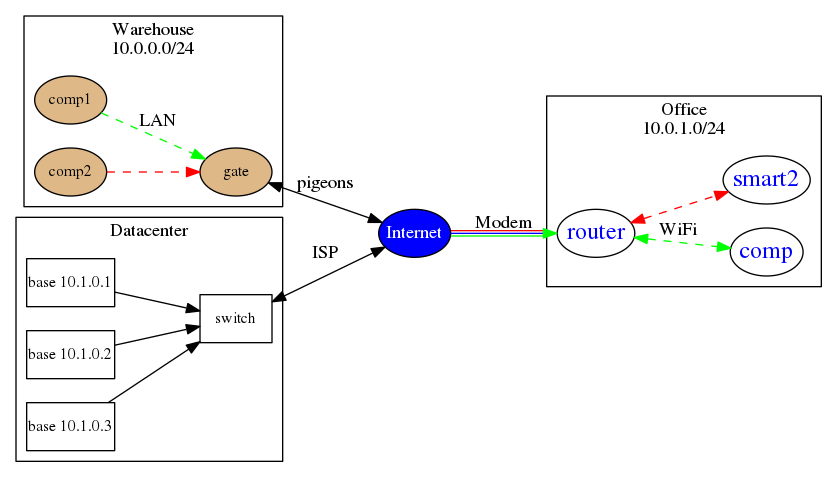

# Немного о Graphviz

Кратко как рисовать в graphviz. Специально накидал тестовую схемку с разными вариантами соединений и т.д.

```
digraph ex{
 rankdir=LR;
 ratio=auto;
 

 node [shape="ellipse", style="filled", fillcolor="blue", fontcolor="#FFFFFF", margin="0.01"];

 subgraph cluster_Warehouse {
     node [fillcolor="BurlyWood", fontcolor="black", fontsize="12"];
         label = <Warehouse
10.0.0.0/24>;
         "comp1";
         "gate";
         "comp2";
     }

 subgraph cluster_Office {
     node [shape="ellipse", style="filled", fillcolor="White", fontcolor="blue", fontsize="18"];
         label = <Office
10.0.1.0/24>;
         "comp";
         "router";
         "smart2";
     }

       subgraph cluster_Datacenter {
               node [shape="box", style="filled", fillcolor="White", fontcolor="black", fontsize="12"];
                       label = <Datacenter>;
         "1base" [label = "base 10.1.0.1"];
         "2base" [label = "base 10.1.0.2"];
         "3base" [label = "base 10.1.0.3"];
         "switch";
               }

 "Internet"->"router"[label="Modem", color="green:blue:red"];

 "router"->"comp"[dir=both,label="WiFi",style="dashed",color="green"];
 "router"->"smart2"[dir=both,laber="LAN",style="dashed",color="red"];

 "comp1"->"gate"[label="LAN",style="dashed",color="green"];
 "comp2"->"gate"[laber="LAN",style="dashed",color="red"];

 "gate"->"Internet"[dir=both, label="pigeons"];

 
 "1base"->"switch";
 "2base"->"switch";
 "3base"->"switch";

 "switch"->"Internet"[dir=both, label="ISP"];

}
```

Генерируем карту из этой схемы
```
dot map.gv -Tpng -o map.png
```

